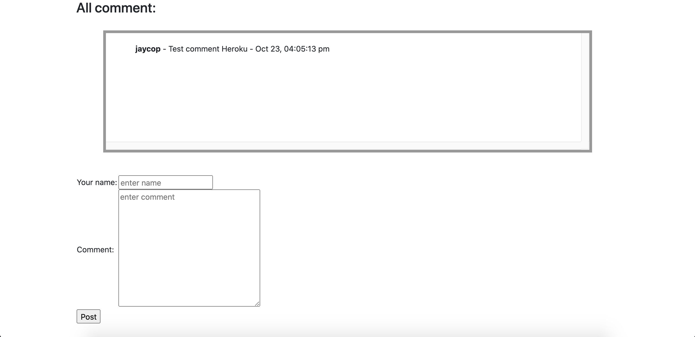

# PHP Basic Comments
>Basic create comment website with PHP

## Table of Contents
  - [Demo](#demo)
  - [Screenshots](#screenshots)
  - [Technologies](#technologies)
  - [Setup](#setup)
  - [Config project](#config-project)
  - [License](#license)

## Demo
Here is a working live demo: [Basic Comments Demo](https://lit-waters-68511.herokuapp.com)
## Screenshots
Example web application page
### Comments page



## Technologies
Project is created with:
- [php >= 7](https://www.php.net/)

## Setup
To clone this project, you need [Git](https://git-scm.com) to install on your computer. command line below:

```zsh
# Clone this repository
$ git clone https://github.com/Bongkot-Kladklaen/PHP-Basic_Comments.git

# Go into the repository
$ cd PHP-Basic_Comments
```
## Config project
1. Create database and table :

    Open project `PHP-Basic_Comments` find file `basic_comment.sql` and Import file to database server for you
2. Config connect database server : 

    Open project `PHP-Basic_Comments` find folder: `config>config.php` to config: hostname, username, password, database
 
    ```php
        # Config database connect
        define('DB_HOST', 'localhost');         // hostname
        define('DB_USER', 'root');              // username
        define('DB_PASS', 'root');              // password
        define('DB_NAME', 'db_comment');       // database
    ```

## License
[MIT](https://choosealicense.com/licenses/mit/)


